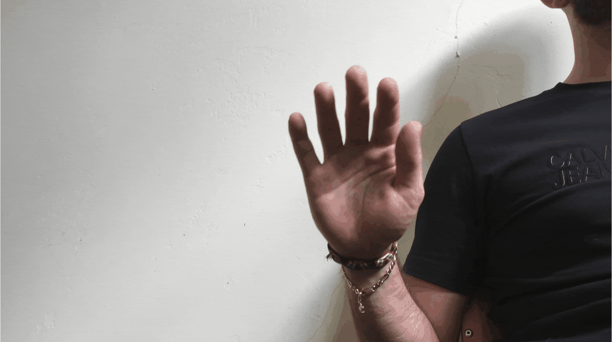
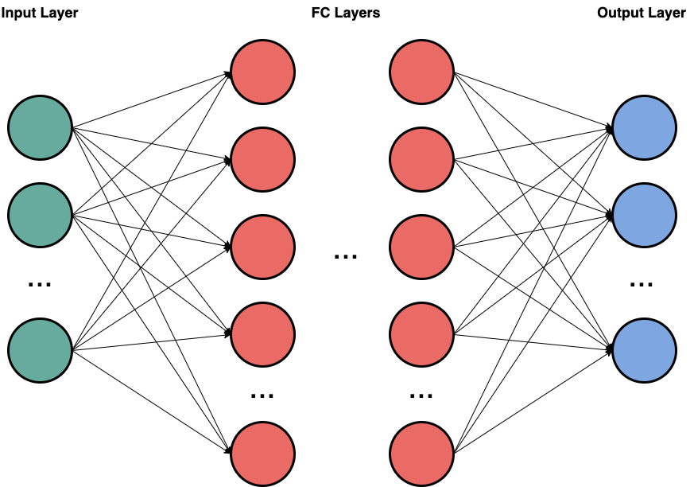
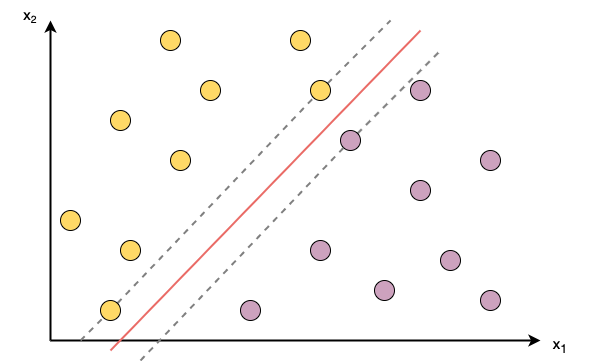

# Hand Gesture Interpreter

This project was created as part of the elective module "Learning From Images" in the MSc. Data Science study program at the Berliner Hochschule für Technik (BHT).
Our aim was to implement a Hand Gesture Recognizer Model that adequately recognizes hand gestures and then to interpret those results within a small application.

## Table of Contents
1. [Introduction and Goal](#introduction)
2. [Theory](#theory)
3. [Dataset](#dataset)
4. [Concept and Design](#concept-and-design)
    1. [Preprocessing](#concept-design-preprocessing)
    2. [Splitting](#splitting)
    3. [Model Fitting](#concept-design-model-fitting)
        1. [Neural Network (NN)](#concept-design-nn)
        2. [Support Vector Machine (SVM)](#concept-design-svm)
    4. [Our Interpreter - Small Application](#concept-design-application)
5. [Implementation](#implementation)
    1. [Preprocessing](#implementation-preprocessing)
    2. [Model Fitting](#implementation-model-fitting)
        1. [Neural Network (NN)](#implementation-nn)
        2. [Support Vector Machine (SVM)](#implementation-svm)
    3. [Our Interpreter - Small Application](#implementation-application)
6. [Results](#results)
    1. [First impression - PCA](#results-pca)
    2. [Confusion Matrices](#results-matrices)
    3. [Evaluation](#results-scores)
    4. [Execution Times](#results-execution-times)
7. [Discussion and Outlook](#discussion)
8. [Conclusion](#conclusion)
9. [References](#references)

## 1. Introduction and Goal

The recognition of hand gestures and the interpretation of those play an important part in human-computer interaction.
Hand Gesture Recognition (HGR) belongs to an active research field.

There are several use cases for gesture recognition, some examples are the understanding of sign language, 
software that requires visual input like video games or assisting tools for situations where physical interaction with
a system or voice commands are not possible. It can also be used in robot remote control or musical creation. \
With the world becoming more and more technology-driven, working in and creating virtual environments becomes increasingly important.
Collaboratively working with virtual and real-world objects is also something that gesture recognition can be useful in.

There are a variety of devices and techniques that have been investigated for
HGR which are skeleton-based and use depth sensors like RGBD cameras [[3]](#references-3).
Here, we only require one RGB camera and use a library from Google (more on that in [section 2](#theory)) to first track 
the 3D skeleton keypoints from the camera image and then use a gesture classifier on those to classify our hand gestures.

**Something worth noting**: We defined a gesture for us not necessarily as a movement but something that can also be a pose
you do with your hand, essentially. This is why for this project, our aim was not to track and recognize hand movements 
where the time component is an important factor, but to recognize hand signs and to correctly classify those. Therefore,
we are looking at frames individually instead of factoring in the time and several frames at once.

## 2. Theory
Recognizing hand gestures is a classic computer vision use case and can be used to tackle many different problems, all of which can be categorized under the topic "human-machine interaction" or HMI. Using visual input to interact with machines in a harsh environment (underwater or in loud areas) where voice or physical inputs are not possible or just using gestures to trigger a camera are potential use cases where gesture recognition can be applied.

When talking about gesture recognition, the process from input to actual recognition can be divided into two subproblems:
- The identification of the hand itself
- The classification of the gesture that the hand is doing. This also includes the class "not a gesture" if the input does not match any previously learned patterns.

The solution in this repository makes use of the mediapipe library made by Google [[2]](#references-2), which is one of the most widely shared and re-usable libraries for media processing. This pre-trained solution already tackles the first subproblem (the identification of the hand(s) itself) with a pre-trained machine learning model. In addition to that, it is also possible to represent the hand not as a sum of pixel values, but as a collection of 21 landmarks that define the hand. The tip of the pinky finger represented by an X, Y and Z-coordinate is one example of those landmarks. The different values of the coordinates are estimated by another pre-trained model contained in the mediapipe library. You can see an overview of those landmarks in the image below.

    

With the different hand landmarks as a database, it was possible to train a model to predict different hand gestures. The output was then used to interact with the classic atari breakout game without physically using our hands as a showcase where this kind of solution can be applied to.

## 3. Data Set
The data used to train the final model(s) was provided by Alessandro Floris and his team, who introduced it in a paper called "A dynamic hand gesture recognition data set for human-computer interfaces" [[1]](#references-1).

The data set consists of 27 classes where each class contains a different dynamic hand gesture. For each class, 21 different participants performed the gesture 3 three times in front of a white wall. All the participants have been trained in how to perform the specific gesture and wrongly executed footage has been excluded from the data set. Also, all the gestures were made from a perspective that would resemble a person sitting in front of a laptop camera. An example of one frame of one gesture can be seen below.

    

This totals a collection of 1701 different videos (63 for each gesture and) stored as HD images in the png format for each frame. The roughly 245 GB of data is stored in multiple .zip files on the IEEE Data Port (on an underlying AWS S3 service).

## 4. Concept and Design
We designed a pipeline consisting of four steps:
1. Preprocessing: Application of Googles MediaPipe Hands to the images
2. Splitting: in training and test data
3. Model fitting: NN and SVM
4. Application of fitted models on a small game

These four steps are further explained in the following:

### Preprocessing: 
Before even starting the actual preprocessing, a solution had to be found to deal with the enormous data size. Handling 245 GB of data on a laptop was no option since the calculation would have taken several hours. Doing multiple iterations to improve the outcome with this limitation would have been a very painful process. Luckily we have the BHT cluster available where we could download the data to a PVC and interact with it using pods. This allowed a less time-intensive interaction with the data.

As described above (see "Theory"), the library mediapipe was then used to detect and convert the single frames of a gesture (as grayscale image) to the coordinates of the different landmarks of the hand. More specifically the sum of pixel values is converted to 21 points described by an X, Y and Z value. This not only reduces the amount of data drastically but also gets rid of most of the noise in the original image (for example all the background data). 

The resulting gestures are saved in the CSV format with one frame per row, described by the initial label of the gesture and 21 columns for each X coordinate of the 21 landmarks and corresponding 21 columns for the Y and Z coordinates. In total 127.000 rows are created.

### Splitting
To properly train and test our gesture classifier models, we split our dataset:
The data was randomly assigned into training and test data by a proportion of 80/20. 
The training data was additionally split into a train and validation set (also in a 80/20 ratio) for fitting the neural networks.\
We then have X_train, X_val and X_test which are the matrices containing our 63 predictor variables/features with roughly 109k entries for training (or about 87k and 22k when further divided into a validation set) and approximately 27k entries in the test set. 
Correspondingly, we have y_train, y_val and y_test which contain our target labels.\
To get reproducible results we set a random seed and managed the whole process of dividing our data and processing it, in the [data management](src/data_management.py) file.

### Model Fitting
As we tried to distinguish between several gestures where we have the target labels, we used supervised learning algorithms and fitted two gesture classification models: A Neural Network (NN)
and a Support Vector Machine (SVM). \
We decided for these two machine learning algorithms as we hoped that they would be able to deal not just with the
high dimensional data but also with non-linear structures inside if there were any.

####   1. Neural Network (NN)
For one of the gesture classifiers, we fitted a NN for the recognition of our hand gestures: \
NNs are modeled loosely on the human brain and can consist of thousands or even millions of simple processing nodes 
that are densely interconnected. They are organized into layers of nodes, and they are “feed-forward”: 
The data moves through them in only one direction [[4]](#references-4). 

    

NNs consist of node layers containing an input layer, several hidden layers and an output layer. Each node is
composed of input data, weights, a bias (or threshold or intercept) and an output. 
The equation for a NN is a linear combination of the independent variables and their respective weights and bias
term for each neuron where the weights help determine the importance of any given variable.

Although we are working with image data we are not using Convolutional Neural Networks (CNNs) like one might initially assume.
This is because the data is already being preprocessed into structured data and keypoints, so performing convolutions where we 
take into account any spatial information is not necessary. \
The outputs are then the probabilities for each class for a certain input. 

####   2. Support Vector Machine (SVM)
Next to the NN also a SVM should be fitted to have a comparison of different algorithms.

    

The SVM is automatically trained with the training data based on the radial basis function as kernel function. It tackles
the data as a multiclass problem. This algorithm is selected as a second model because it is able to also deal with high 
dimensional data. \
Something to keep in mind for SVMs is that they are normally applied on binary problems and tend to not work that well with multi-class classification.
Furthermore, SVMs can be quite slow if you have too many training samples.

### Implement a small application to show the working system
To test our model in the real world we decided to apply the better model on a small game. 
A break-out game seemed to be good for this. There are just two possible moves for the bar: go to the left or go to the right.
Hence there are also just two gestures needed to control the game. The whole pipeline should be kept easy and is oriented 
on the steps seen above. The camera should take a picture. As within the preprocessing part, the image is analysed by the
mediapipe and the coordinates are then passed to the forward-path of the NN or the SVM to take a prediction of the assumed
class. According to the prediction the bar is then moved to the right or left as long as the gesture is seen. If the image
is not classified as one of the gestures above the bar is also not moving.

## 5. Implementation

In the following section we will go into our actual implementation and how this might have deviated from our original concepts
we talked about in [section 4](#concept-and-design). Problems, measures for improvement and other aspects will be discussed as well. 

### Preprocessing 
Mediapipe was used to detect the hand in a frame and extract specific landmarks from the gesture. Those landmarks are represented by 3D coordinates and are the database for the model.

The values for the X and Y values are automatically scaled between 0 and 1 corresponding to the original size of the image. Therefore also the position of the landmark (and hand) is still included in the coordinates. For the Z coordinate, the mediapipe model calculates a value relative to the landmark of the bottom of the palm (which is therefore assigned the baseline value "0"). Possible values for Z range between very small numbers like 0.001 and bigger like 180 which makes them hard to work with, since the scale seems off. Further information on handling the initial scaling is in the following parts.

Before continuing it is wise to get rid of the observations where mediapipe was not able to detect a hand or detected multiple hands. The according frames are not looked at further and are just skipped.

The automatic scaling of the mediapipe output for the X and Y coordinates is problematic for the use case, since it does not give the relative value of the landmarks to each other, but the value of the landmark in relation to the position in the image. In other words, the same gesture once done in the top right of a frame and once in the bottom left of another frame will result in drastically different coordinate values, even if both gestures are identical. To remove the noise of the positional difference, another scaling was applied.

This second scaling of the data does not look at the whole image, but only at the extracted landmarks. More specifically at the X, Y and Z coordinates over all the landmarks of one frame separately. They are then scaled from values of 0 (for the smallest value) and 1 (for the biggest). This is one way of extracting the hand from the full image and is a simpler version of the related approach of using bounding boxes.

One example for more clarity: Two separate frames have the same hand gesture, where a person once makes a thumbs-up gesture in the top left and once in the bottom right of an image. Even when both gestures are identical, the coordinates will very much differ, since the gesture in the top left will have X and Y values closer to one and the gesture in the bottom right closer to 0. By rescaling the X values between the lowest X coordinate of all the landmarks in one frame (probably the tip of the thumb, since it is a thumbs-up gesture) and the highest X value (probably the bottom of the pinky / the pinky metacarpophalangeal) both frames will have the same values for each X coordinate. The position in the original frame is not important anymore.

The same is done for the Y and Z coordinate. Criticism: It could be said that this method will distort the relations of the landmarks since it will be always scaled between 0 and 1 for each dimension separately. More specifically a hand gesture of a raised hand with fingertips sticking together and a gesture of a raised hand with fingers spread apart will result in the same coordinates after rescaling since the X values will always be between 0 and one for thump to pinky.

After a manual inspection of the different gestures, it was clear that some of them do not differ at all when looking at the single frames. With some gestures, it was even hard for the human inspector to separate a gif into one of two classes when looking at them.

To tackle this problem a selection of similar gestures (when only looking at the single frames) was created and given the same label. With this, the number of different classes was reduced from 27 to 17. It is important to mention that only classes with overall comparable frames (like waving from right to left, vs waving from left to right) have been combined. More complex gestures where only a part of the frames would fully match another class have not been added to a new collection. An overview of the very similar example classes 20 and 21, as well as the combination schema for the new collections can be seen beneath. 

<!-- 
Since we have many classes, 27 to be precise, the number of cases where our prediction is equal to our true label is smaller when
we have more classes. This leads to fewer True Positives (TPs) and therefore lower evaluation scores regarding our accuracy.
Another problem was that many of our gestures were quite similar to each other, e.g. when looking at class 20 and 21 at first glance
there is visually almost no difference. This is another challenge that our models had to face during training.
--> 

| Gesture Class 20 | Gesture Class 21 |
|--------------|----------------------|
 | 

<!-- 
For what we were trying to achieve, correctly distinguishing between gestures that are that similar wasn't necessary. To get
a better classifier we then examined the data and the classes manually and decided to combine several classes into one, e.g.
gesture classes 1, 2 and 3 became one class. More details can be found in the following table:
--> 

| New class... | ... consists of the old classes: |
|--------------|----------------------------------|
| Collection 1 | 1, 2, 3                          |
| Collection 2 | 4, 17                            |
| Collection 3 | 5, 6                             |
| Collection 4 | 7, 8, 20, 21                     |
| Collection 5 | 9, 13                            |
| Collection 6 | 10, 19                           |
| Collection 7 | 11, 18                           |
| Class 12     | 12                               |
| Class 14     | 14                               |
| Class 15     | 15                               |
| Class 16     | 16                               |
| Class 22     | 22                               |
| Class 23     | 23                               |
| Class 24     | 24                               |
| Class 25     | 25                               |
| Class 26     | 26                               |
| Class 27     | 27                               |

<!-- 
After combining several classes we were left with 17 distinct labels: We reduced the number of total classes and combined
similar ones which then should lead to better classification results.
-->

For further work on this task, it could be useful to (instead of a manual inspection) cluster the single frames by a clustering algorithm and then create new labels based on the insight of some samples of each cluster.

The resulting gestures are saved in the CSV format with one frame per row as described in the "Design" part.

### Model Fitting
As mentioned earlier we decided on two different models for the gesture classification. After training the first models however,
we noticed that the multi-class classification could be improved:

After training our models we saved them into the [models folder](models/) so we can easily retrieve and use them for 
our evaluation and for the implementation in our application to quickly show the working system.

#### 1. Neural Network (NN)
Fitting a rather simple Feedforward Neural Network (FFNN) already proved as sufficient enough for our purposes, so there 
was no need for a more complex network architecture. \
We tried out several different configurations and played around with different hyperparameter values: For the latter, there was
the number of epochs to train with, the batch size (since we are training in batches) as well as the learning rate for our optimizer
where we used the Adam optimizer. For our loss function we used "Sparse Categorical Crossentropy" since this is a 
classification problem and our labels were cast to integers. For the metric we used Accuracy.\
After a certain number of epochs the training accuracy only increased slightly while the validation accuracy did not and even got
a little worse than before. Therefore, we decided to stop after 150 epochs. For batch size we settled with a value of 128
and for the learning rate, after first using a rate around 0.01 we worked our way down to 0.001 as this yielded higher 
accuracy scores as well. Furthermore, we also tried adding and removing additional layers and trying out a different number
of nodes. Adding two to three more layers did give better results, however, after a certain number of layers the trade-off
between improved results and network model complexity was not worthwile. \
We finally settled for a network with all 63 predictor variables as input, 6 fully-connected hidden layers and a softmax
output for the probabilities for the different classes (27 originally and 17 with the combined classes approach). 
We then predicted using the class with the highest probability for a certain input. \
We also tried adding dropout layers to prevent overfitting. But since our model did not seem to overfit and the evaluation results
for the model with the dropout layers were not good, we decided to not further follow that approach.

The graphs for our final network trainings can be seen below. The training for the NN that is based on the combined classes 
approach looks very similar to the original one, only the accuracy values for the former are higher.

Training Original | Training with Combined Classes |  Training with Dropout Layers
:-------------------------:|:-------------------------:|:-------------------------:
  |   | 

#### 2. Support Vector Machine (SVM)
As mentioned earlier SVM has problems when fitting lots of data. Not because of the results but caused by the calculation time: 
The length of the dataset is not just taken linearly into account but quadratic. This caused computational times of over 
an hour per run. These times 
appeared to happen with a first demo data set containing fewer variables. So the computational times were reduced by taking
the real dataset which had more dimensions and was therefore easier to process for the SVM and also by reassigning the class
variables from strings to integers. This accelerated the whole training time from an hour down to just 5 minutes.
But also the long training times before have not been a real problem, the development had just been slowed down. 
Fortunately, this algorithm does not have as many hyperparameters as NN for example. So there was not so much optimization needed.

### Implement a small application to show the working system
As said before, we needed the saved models especially for the game. Nobody wants to play it if the training of the NN or
the SVM takes several minutes. For that reason we just imported one model at the beginning of the game and used that for the
predictions. The loading times have been reduced to be acceptable for the player.
While developing the game we discovered that combining the classes had also a good effect on the game itself. Instead of 
choosing several classes per direction, one for each direction was enough. This improved the game play as the speed
of the game increased.

## 6. Results
Different metrics were applied to get an overview how good the algorithms perform. First, we did a Principal Component Analysis (PCA), 
then we generated the confusion matrices and calculated metrics from it and lastly, we had a short look on the execution times.

####   a) First impression - PCA
For a first impression on the data we did a PCA to have a look if there are already classes
which could be easily separated.

The first two components represent almost 50% of the variance. So with displaying it in two dimensions, more than one half
of the variance cannot be explained. So it is also not surprising that we cannot clearly separate classes from each other.
But one can see that some clusters of classes are formed. And just few classes are spread around the whole area.

The combination of these formed clusters by just explaining 50% of the variance gives some hope that a good separation of 
the data with more dimensions being involved is possible.

####   b) Confusion matrices to find similar gestures
To get a good impression on how well the algorithms perform for the different classes we generated the confusion matrices.
Values on the diagonal should be high as they mean "The algorithm predicted a given input vector as belonging to the class
and it actually belonged to the class". On the opposite, values in the rest of the matrix should be low as these mean "Given a vector
the prediction was wrong". The colors are set accordingly. 

In the figure above, one can clearly see several clusters of classes where the SVM algorithm mispredicted some gestures.
For example, the classes one to three or the classes 20 and 21 form this kind of clusters. This plot was the basis of our
manual collections of classes as mentioned above. But in general, it can be stated that there are also classes which can be 
classified quite precisely, e.g. classes 24 and 25.

In the version where the SVM algorithm was run on the combined classes, one can see that some classes could be classified
better as class 16 but as we did it manually, one can also see that there are still collections which should be combined 
even further like the collections one and two. 

For the NN confusion matrix a similar figure is shown. It also shows the same clusters of classes which should be combined to 
collections. But in comparison to the first figure, it can be easily stated that the overall classification is better as
there are a lot less misclassified predictions compared to the SVM. So the NN performs better on this task and this accords
to our results above.

The results for the NN with the collections is again similar to the SVM but also like the non-combined NN better than its SVM
counterpart. Overall this is also not surprising as we would have expected that both algorithms perform better but the order would
not change. 

In total, these results give us a good understanding of the data. They show gestures which might be similar if they are just 
interpreted frame-by-frame. That the algorithms come to similar results which classes should be combined to collections also
make our results more reliable. We would have been surprised if the algorithms suggest combining different classes. Like this,
they support each other.

####    c) Evaluation Scores
After generating some graphs, we also calculated some scores to compare the algorithms with one number. We first tried the 
accuracy but as this is a multiclass
problem and if we calculate a one-vs.-all accuracy metric, we get unreliable results. In that case the values for the true
negatives are far higher than all the others. So we always get good results.

Instead we decided to use the F1-Score: It factors in Precision and Recall, so it is a balanced measure between those two.
The F1-Score is also more sensitive to data distribution, so this metric can also be used for imbalanced data sets and 
multiclass classification as we did. Now we got more different values for the algorithms. They are shown in the table below.

| Algorithm    | Accuracy | F1-Score |
|--------------|----------|----------|
| SVM          | 0.979    | 0.723    |
| SVM combined | 0.983    | 0.858    |
| NN           | 0.987    | 0.820    |
| NN combined  | 0.979    | 0.904    |

It is not surprising to us that the NN is better than SVM as it is also the more complex and adaptive model. At the same
time we are not surprised that classes which we combined manually by looking on the confusion matrices gave better results
after combining.

####    d) Execution Times
Lastly, we also had a look on the Execution Times for the training and testing of the algorithms:

| Algorithm    | Training | Testing  |
|--------------|----------|----------|
| SVM          | 6:54 min | 4:10 min |
| SVM combined | 6:14 min | 2:20 min |
| NN           | 2:36 min | 0.20598s |
| NN combined  | 2:38 min | 0.20813s |

It can be seen that training and testing of the NN is a lot faster than for the SVM. This can be explained by the length 
of the data set which is taken quadratically into account for calculating the SVM whereas the NN has not been slowed down too
much by more data.

## 7. Discussion and Outlook
When it comes to the F1-score (0.904) returned by the best model, it can be said that this project was a success. The identification of different gestures when only having one frame of a dynamic gesture as input works. Also, the combination of similar gestures proves to be quite effective. Not only does the model work, but we could also show a concrete use case where it can be applied to, the breakout game.

Still, some aspects could be improved or handled differently, if the project would be done again / would continue with more time. The most promising improvement to get better results would be the introduction to semi-supervised learning for the pre-processing part. Instead of using the collection of frames for each dynamic gesture under the label of this gesture to create training data for static gestures, it might be worth looking at each frame separately and deciding which static gesture might be displayed. By doing so, the packaging step after the pre-processing would be redundant and it might be possible to identify multiple different static gestures in one dynamic one.

To do so, the frames could be pre-processed using mediapipe as described above, but instead of using the label of the dynamic gesture, the different gestures could be first clustered with k-means, dbscan or any other clustering algorithm and afterwards labelled manually. To ensure a good output, the clustering step has to be evaluated by using a fitting score like the silhouette score or rand index. For the labelling, one or more people would have to look at each cluster and take a sample of maybe 5 to 15 images and give them a fitting label. Those clusters will then be used as classes for the training of the actual classification model, with the manual labels as target values. This process could take some time and effort since different numbers of clusters should be evaluated and the manual labelling part is very time-consuming by nature since a lot of discussions can be made of the correct label of a cluster. It might even be necessary to improve the preprocessing to ensure clusters that fit the human interpretation of similar gestures and not only the one of the clustering model.

A second improvement that would not affect the result, but the time needed to achieve it, might be the improvement of the pre-processing pipeline by using parallelization on the Kubernetes cluster. This could be either done by using multiple pods for the task or using pyspark on one or more pods to divide one task into multiple ones. This improvement step might not be easy to achieve since Kubernetes and Pyspark are known to have a quite steep learning curve for beginners. Nevertheless, this improvement could shorten the time needed for preprocessing and therefore leave more time for other steps that could have a positive influence on the model performance.

Apart from the applying semi-supervised learning in a future approach, we would also apply the gestures on other
applications, like a small racing game or as control gestures of a smart home system.
Further research should also focus on tweaking the algorithms by having a closer look on the optimization of the 
hyperparameters. This could be done by using a cluster solution. The preprocessing was already done on a Kubernetes cluster.
Also, a gridsearch could be performed on such a computational cluster. The SVM algorithm does not leave many options on 
enhancing it but for the NN there are several other configurations e.g. with more or other layers that could be tried out.
It would furthermore be a big gain for the applications if multi-hand models would be developed or more gestures would be 
added to the training data set to expand the possible gestures to more than these 17 collections or 27 classes.

## 8. Conclusion
This project shows a python implementation of two trained models to recognize and interpret 27 different hand gestures. 
To raise the reliability of the models, classes which show similar gestures were combined into collections. 
The performance of the models were then demonstrated in a simple breakout game by using gestures to control the bar. 

## 9. References

[1]	Floris, A. (2021, September 9). Dataset for Dynamic Hand Gesture Recognition Systems. IEEE DataPort. 
	Retrieved February 05, 2022, from https://ieee-dataport.org/documents/dataset-dynamic-hand-gesture-recognition-systems 

[2]	Hands - mediapipe. (n.d.). Google. Retrieved February 05, 2022, from https://google.github.io/mediapipe/solutions/hands 

[3] Sung, G. & Sokal, K. & Uboweja, E. & Bazarevsky, V. & Baccash, J. & Bazavan, E. & Chang, C. & Grundmann, M. (2021). 
    On-device Real-time Hand Gesture Recognition. Google Research. https://arxiv.org/pdf/2111.00038.pdf

[4] Hardesty, L. (2017). Explained: Neural Networks - Ballyhooed Artificial-Intelligence Technique Known as ‘Deep Learning’ Revives 70-Year-Old Idea. MIT News Office. 
    https://news.mit.edu/2017/explained-neural-networks-deep-learning-0414
